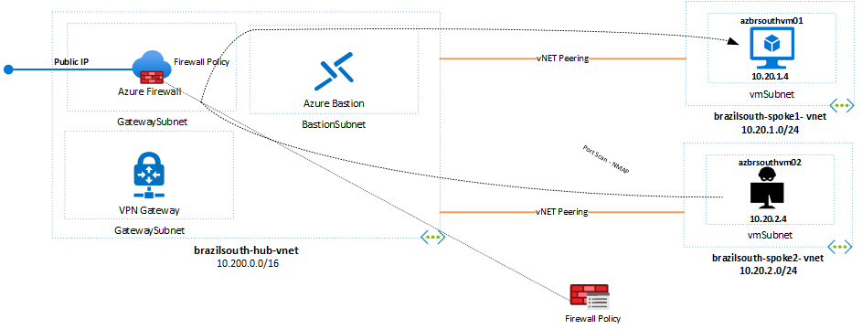

# Challenge 3: IDPS

[< Previous Challenge](./00-prereqs.md) - **[Home](../README.md)** - [Next Challenge >](./02-acr.md)

## Introduction

In this challenge, you will set up the network intrusion detection and prevention system (IDPS) to monitor the malicious activity in your virtual network.



## Description

The network intrusion detection and prevention system (IDPS) provides rapid detection of attack based on signature. You will set up, monitor and block malicious attack through the Azure Firewall and Log Analytics workspace.

#### Task 1 - Enabling the IDPS to alert network malicious attack

To start the setup, follow the steps listed below:

1. Login to Azure Portal [https://portal.azure.com/](https://portal.azure.com/)
    - To start Azure Cloud Shell:
        - Select the Cloud Shell button on the menu bar at the upper right in the Azure portal. 

    

2. Ensure you are properly logged in to your tenant and with a subscription selected for Azure. You can check that by using:

```azure cli
az account list --output table
az account set --subscription "My Subscription"
```

- Setup the IDPS trought Firewall Policy  **azfw-policy-std**, and using the Azure Cloud Shell:

```bash
az network firewall policy update --name azfw-policy-std -g wth-azurefirewall-rg --idps-mode Alert --sku Premium
```

- Connect to **azbrsouthvm02 - 10.20.2.4** via Bastion, open the command prompt and run it:

```bash
nmap -sV 10.20.1.4
```


:question:Any alert?

Wait to complete the command with the destination information. Look at the Firewall logs and verify if it triggers an alert in the Azure Log Analytics. You can use the following You can use the below Kusto Query:

```bash
AzureDiagnostics
| where OperationName == "AzureFirewallIDSLog" and msg_s contains "IDS: SCAN NMAP"
| parse msg_s with * ". Signature: " IDSSignatureIDInt ". IDS: " IDSSignatureDescription ". Priority: " IDSPriorityInt ". Classification: " IDSClassification
| parse msg_s with Protocol " request from " SourceIP " to " Target ". Action: " Action
| order by TimeGenerated
| limit 10
```


#### Task 2 - Deny the network malicious attack

Now you will block any tentative by network attack inside the virtual network.

- Follow the steps 1 and 2 of **Task 1** and run the below command on Azure Cloud Shell.

```bash
az network firewall policy update --name azfw-policy-std -g wth-azurefirewall-rg --idps-mode Deny --sku Premium
```

- Connect to **azbrsouthvm02 - 10.20.2.4** via Bastion, open the command prompt and run it:

```bash
curl -A "BlackSun" 10.20.1.4
```


:question: What is the result?

You can verify if it triggers a deny alert in the Azure Log Analytics. You can use the below Kusto Query:

```bash
AzureDiagnostics
| where OperationName == "AzureFirewallIDSLog"
| parse msg_s with * ". Signature: " IDSSignatureIDInt ". IDS: " IDSSignatureDescription ". Priority: " IDSPriorityInt ". Classification: " IDSClassification
| parse msg_s with Protocol " request from " SourceIP " to " Target ". Action: " Action
| order by TimeGenerated
| limit 5
```

## Success Criteria

1. You detect the port scan through the Azure Log Analitycs.
2. You have updated the IDPS policy.
3. You blocked the network malicious attack.


## Learning Resources

- [Deploy and configure Azure Firewall Premium](https://docs.microsoft.com/en-us/azure/firewall/premium-deploy)</br>
- [Firewall/IDS Evasion and Spoofing](https://nmap.org/book/man-bypass-firewalls-ids.html)

