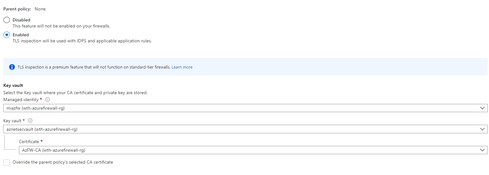

# Challenge 3: TLS Inspection

[< Previous Challenge](./00-prereqs.md) - **[Home](../README.md)** - [Next Challenge >](./02-acr.md)

## Introduction

In this challenge, you will set up the TLS inspection to decrypts outbound traffic in your virtual network.

## Description

The TLS inspection feature allows the firewall to decrypt outbound traffic transmitted to and sent to internet resources. Once the traffic is decrypted, a proper analysis of the content can be performed. After the analysis is complete, the data is re-encrypted and transmitted to the client.

#### Task 1 - Enabling the TLS Inspection to terminate outbound traffic

To start the setup, follow the steps listed below:

1. Login to Azure Portal [https://portal.azure.com/](https://portal.azure.com/)
    - To start Azure Cloud Shell:
        - Select the Cloud Shell button on the menu bar at the upper right in the Azure portal. 

    

2. Ensure you are properly logged in to your tenant and with a subscription selected for Azure. You can check that by using:

```azure cli
az account list --output table
az account set --subscription "My Subscription"
```

- Import the .PFX file as certificate on Azure Key Vault use the Azue CLI to do that. 

```bash
az keyvault certificate import --vault-name "aznetsecvault" --file "interCA.pfx" --name "AzFW-CA"
```

- Enable the TLS Inspection thought to Firewall Policy  **azfw-policy-std**, and use the Azure Portal to enable.




- Create an application rules trought Firewall Policy  **azfw-policy-std**.

```bash
az network firewall policy rule-collection-group collection add-filter-collection -g wth-azurefirewall-rg --policy-name azfw-policy-std --rule-collection-group-name DefaultApplicationRuleCollectionGroup --name rule-allow-site-threat-intell --action Allow --rule-name allow-site-threat-intell --rule-type ApplicationRule --source-addresses "10.20.1.4" --protocols Http=80 --target-fqdns testmaliciousdomain.eastus.cloudapp.azure.com --collection-priority 11100
```

- Connect to **azbrsouthvm01 - 10.20.1.4** via Bastion, open the powershell, and import the public certificate using the below command line.

```powershell
New-Item -Name azfw-tlsinspec -ItemType Directory
cd ./azfw-tlsinspec
Invoke-WebRequest -Uri https://raw.githubusercontent.com/adicout/azurefirewall-microhack/main/Student/Resources/certificates/rootCA.crt -OutFile rootCA.crt
Import-Certificate -FilePath .\rootCA.crt -CertStoreLocation Cert:\LocalMachine\Root\
```

- Verify if imported certificate.

```powershell
Get-ChildItem -Path Cert:\LocalMachine\Root
```


#### Task 2 - Validate TLS Inspection

You will access the URL  any tentative by network attack inside the virtual network.

- Create an application rules trought Firewall Policy  **azfw-policy-std**.

```bash
az network firewall policy rule-collection-group collection add-filter-collection -g wth-azurefirewall-rg --policy-name azfw-policy-std --rule-collection-group-name DefaultApplicationRuleCollectionGroup --name rule-allow-site-threat-intell --action Allow --rule-name allow-site-threat-intell --rule-type ApplicationRule --source-addresses "10.20.1.4" --protocols Http=80 --target-fqdns testmaliciousdomain.eastus.cloudapp.azure.com --collection-priority 11100
```

- Follow the steps 1 and 2 of **Task 1** and run the below command on Azure Cloud Shell.

```bash
az network firewall policy update --name azfw-policy-std -g wth-azurefirewall-rg --idps-mode Deny --sku Premium
```

- Connect to **azbrsouthvm02 - 10.20.2.4** via Bastion, open the command prompt and run it:

```bash
curl -A "BlackSun" 10.20.1.4
```


:question: What is the result?

You can verify if it triggers a deny alert in the Azure Log Analytics. You can use the below Kusto Query:

```bash
AzureDiagnostics
| where OperationName == "AzureFirewallIDSLog"
| parse msg_s with * ". Signature: " IDSSignatureIDInt ". IDS: " IDSSignatureDescription ". Priority: " IDSPriorityInt ". Classification: " IDSClassification
| parse msg_s with Protocol " request from " SourceIP " to " Target ". Action: " Action
| order by TimeGenerated
| limit 5
```

## Success Criteria

1. You detect the port scan trought the Azure Log Analitycs.
2. You have updated the IDPS policy.
3. You blocked the network malicious attack .


## Learning Resources

- [Deploy and configure Azure Firewall Premium](https://docs.microsoft.com/en-us/azure/firewall/premium-deploy)</br>
- [Firewall/IDS Evasion and Spoofing](https://nmap.org/book/man-bypass-firewalls-ids.html)

